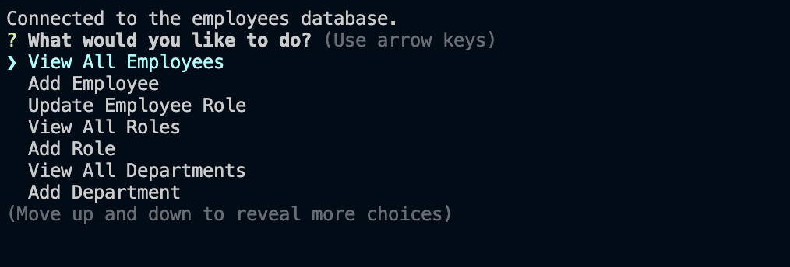

# EmployeeTracker
 
 This application utilizes Node.js, Inquirer, and MySQL to provide a managment system for an employee database from the command-line.

 [Employee Tracker](https://github.com/kthames/EmployeeTracker)


[Walkthrough Video of the Employee Tracker](https://drive.google.com/file/d/1VILw4v13hi6SZoDofsj5FmzM5S2lZKMX/view)

## Installation

run the following in the terminal:

```md
npm install mysql2
```

```md
npm install inquirer
```

```md
npm install console.table --save
```

in terminal

## Usage

- Navigate to db/connection.js and input your my sql user and password,
- run the schema and seeds files by running the follow commands in the mysql shell:

```md
source db/schema.sql
```

```md
source db/seeds.sql
```

- Navigate to the root directory of the project and type in terminal:

```md
npm start
```
Then the prompts will begin.

